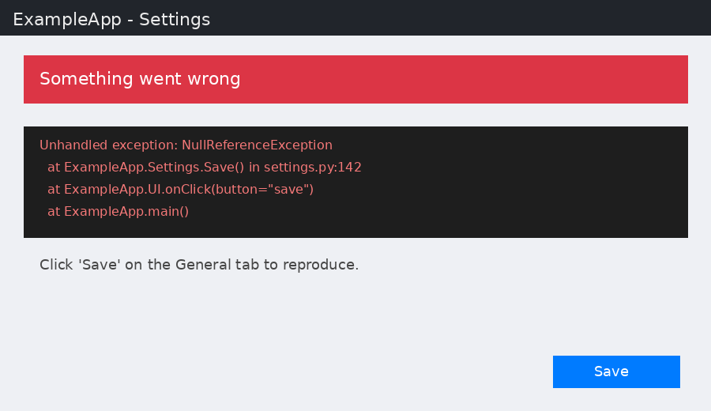
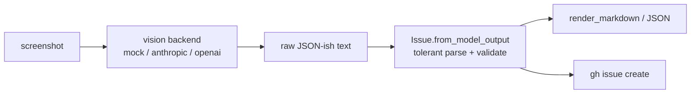

# shot2issue

> Drop a screenshot of a bug; get a structured GitHub issue with repro steps and labels.

[](./LICENSE)
[](https://www.python.org/downloads/)
[](#development)
[](https://docs.astral.sh/uv/)
[](#contributing)

`shot2issue` turns a screenshot of a bug — an error dialog, a broken UI, a stack
trace — into a clean, structured GitHub issue: a clear title, a description,
ordered repro steps, expected/actual behavior, and suggested labels. The vision
backend is pluggable (Anthropic or OpenAI via an env key), and a built-in
`--mock` mode runs the whole pipeline with **no key and no network**, so it is
trivial to try and fully testable in CI. Print it as Markdown, dump it as JSON,
or file it straight to GitHub with `gh`.

## Why it exists

Good bug reports take effort: a precise title, repro steps, and the right
labels. In practice people paste a screenshot into a chat and move on, and the
context is lost. `shot2issue` closes that gap — point it at the screenshot you
already have and it drafts a proper issue for you, ready to review and file.

## Demo

Below is a **synthetic** bug screenshot (generated by `--make-sample`, drawn
entirely with PIL — no real app, no real data) and the structured issue
`shot2issue` produces from it in `--mock` mode.

**Input** — `assets/sample-bug.png`:



**Run it** (no API key required):

```console
$ uv run shot2issue --make-sample assets/sample-bug.png
Wrote synthetic sample screenshot to assets/sample-bug.png

$ uv run shot2issue assets/sample-bug.png --mock
# (generated with --mock backend)
```

**Output** — rendered GitHub-flavored Markdown (the `# (generated with --mock
backend)` notice above is printed to stderr, so it never pollutes the body):

```markdown
# App crashes with NullReferenceException on Save

## Description
The screenshot shows an unhandled error dialog appearing when the user clicks the Save button on the settings page. A red banner reads 'Something went wrong' above a stack trace.

## Steps to Reproduce
1. Open the application and navigate to Settings
2. Change any field in the General tab
3. Click the Save button

## Expected Behavior
The settings are saved and a success toast is shown.

## Actual Behavior
An error dialog appears with a NullReferenceException and the settings are not saved.

## Suggested Labels
`bug` `crash` `settings`
```

The same pipeline can emit machine-readable JSON for scripting:

```console
$ uv run shot2issue assets/sample-bug.png --mock --format json
{
  "title": "App crashes with NullReferenceException on Save",
  "description": "The screenshot shows an unhandled error dialog appearing when the user clicks the Save button on the settings page. A red banner reads 'Something went wrong' above a stack trace.",
  "repro_steps": [
    "Open the application and navigate to Settings",
    "Change any field in the General tab",
    "Click the Save button"
  ],
  "expected": "The settings are saved and a success toast is shown.",
  "actual": "An error dialog appears with a NullReferenceException and the settings are not saved.",
  "labels": [
    "bug",
    "crash",
    "settings"
  ]
}
```

> The mock backend returns a canned fixture, so this output is deterministic. A
> real screenshot run goes through the same parse/render path — only the JSON
> comes from a live vision model instead of the fixture.

## Install

Requires Python 3.11+. The project is built and managed with
[uv](https://docs.astral.sh/uv/).

```bash
# from a clone of this repo
git clone https://github.com/amanzainal/shot2issue.git
cd shot2issue
uv sync

# run the CLI through uv
uv run shot2issue --version
```

Prefer a global install of the CLI:

```bash
# install the command onto your PATH from the cloned repo
uv tool install .

# or with pipx
pipx install .
```

To use a real vision backend, copy the example env and set exactly one key:

```bash
cp .env.example .env
# then edit .env and set ANTHROPIC_API_KEY or OPENAI_API_KEY
```

Keys are read from the environment only — nothing is ever hardcoded. The
optional Anthropic/OpenAI SDKs are installed on demand (`pip install anthropic`
or `pip install openai`); the `--mock` path needs neither.

## Usage

```text
shot2issue [IMAGE] [--repo OWNER/NAME] [--backend {mock,anthropic,openai}]
           [--mock] [--format {markdown,json}] [--create]
           [--make-sample PATH]
```

| Flag | What it does |
| --- | --- |
| `IMAGE` | Path to the bug screenshot (PNG/JPG). Omit only with `--make-sample`. |
| `--mock` | Use the canned mock backend — no API key or network needed. |
| `--backend {mock,anthropic,openai}` | Force a specific vision backend (default: auto-detect from env). |
| `--format {markdown,json}` | Output format for the structured issue (default: `markdown`). |
| `--repo OWNER/NAME` | Target repository for `--create` (e.g. `octocat/hello-world`). |
| `--create` | File the issue on GitHub via `gh issue create` (requires `gh`). |
| `--make-sample PATH` | Generate a synthetic sample screenshot at `PATH` and exit. |
| `--version` | Print the version and exit. |

### Against a real screenshot with a vision LLM

```bash
# auto-detects the backend from whichever key is set in your environment
uv run shot2issue bug.png

# or force one
uv run shot2issue bug.png --backend openai
```

### File it directly on GitHub

With the [`gh`](https://cli.github.com/) CLI installed and authenticated:

```bash
uv run shot2issue bug.png --repo octocat/hello-world --create
```

This renders the Markdown body, passes each suggested label through as its own
`--label` flag, and runs `gh issue create` for you. If `gh` is not available,
`shot2issue` prints the Markdown to stdout instead so you can paste it yourself.

## How it works

1. **One prompt contract.** `shot2issue` asks the vision model for a single JSON
   object with a fixed set of keys (`title`, `description`, `repro_steps`,
   `expected`, `actual`, `labels`). The prompt lives in one place so every
   backend asks for the exact same shape and never drifts from the parser.
2. **Pluggable backend.** `mock`, `anthropic`, and `openai` backends are
   registered by name. Selection is driven by `--mock`, `--backend`,
   `SHOT2ISSUE_BACKEND`, then an available provider key — in that order. A
   backend is just `(image_path) -> raw model text`, so adding one is small.
3. **Tolerant parsing.** Model output is parsed into an `Issue` dataclass even
   when the JSON is wrapped in a ```` ```json ```` fence or buried in prose.
   Types are normalized (a newline-joined string becomes a list, blank labels
   are dropped) and required fields are validated.
4. **Render or file.** The `Issue` is rendered to GitHub-flavored Markdown (or
   JSON), or filed via `gh issue create`.



## How this differs

This space already has good tools; `shot2issue` fills a specific gap between
them. Comparing honestly:

| Tool | What it does | The gap `shot2issue` fills |
| --- | --- | --- |
| **GitHub Issue Forms / templates** | Give contributors a structured form to fill in by hand. | Still entirely manual. `shot2issue` drafts the structured fields *for* you from an image you already have. |
| **`gh issue create`** | Files an issue from a title/body you supply. | Has no opinion about *content*. `shot2issue` is the layer that produces a clean body and labels, then hands off to `gh` for filing. |
| **Pasting a screenshot into an LLM chat** | One-off, conversational triage. | No fixed schema, no labels, nothing scriptable. `shot2issue` enforces one JSON contract, parses tolerantly, and can run headless in CI or a script. |
| **Issue-triage bots / Actions** | Auto-label or route *existing* issues after they are opened. | Operate *after* an issue exists. `shot2issue` works *before* — turning the raw screenshot into the issue in the first place. |

In short: the value is the **typed contract between a screenshot and a filed
issue** — a single prompt shape, a validated `Issue` dataclass, tolerant
parsing, and clean Markdown/JSON rendering — with `gh` as an optional last hop.

## Project status

This is a focused **v0.1** with a small, well-tested core (39 passing tests
covering schema parsing, Markdown rendering, backend selection, the `gh`
command builder, and the full mock CLI path). The `--mock` path is production-
ready and runs offline. The live `anthropic`/`openai` backends are wired and use
each provider's standard vision API; treat them as the early, real-but-evolving
part of the project — the prompt and default model ids will keep improving. No
fabricated benchmarks or usage numbers are claimed here; what is described is
what the code does today.

## Development

```bash
uv sync
uv run pytest -q
```

The test suite covers schema parsing, Markdown rendering, backend selection, the
`gh` command builder, and the full mock CLI path — no API key or network
required.

## Roadmap

- Redaction pass to blur secrets/PII detected in the screenshot before upload.
- A local OCR fallback backend (no cloud) for offline triage.
- De-duplication against existing open issues before filing.
- Attach the original screenshot to the created issue.
- A config file for default repo, labels, and backend.

## Contributing

Issues and PRs are welcome. A good first contribution is a new backend — a
backend is just a callable `(image_path) -> raw model text` registered by name
in `backends.py`. Please run `uv run pytest -q` before opening a PR and add a
test for anything new.

## License

MIT — see [LICENSE](./LICENSE). Copyright (c) 2026 Aman Zainal.
